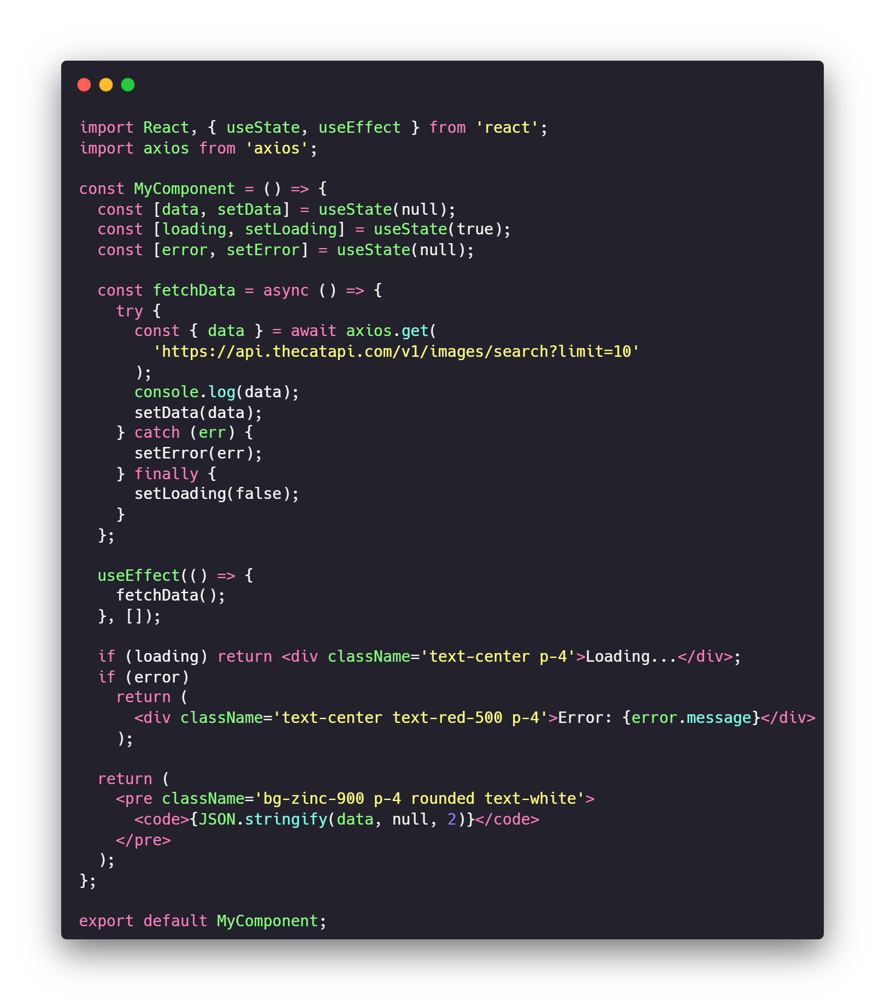

# MERN 4 VS Code

---

### Autor

### Otros idiomas

- [English](README.md)

**Si no puedes acceder al contenido de la traducción, por favor, visita la [documentación oficial](https://mern-snippets-4-vscode.netlify.app/docs/intro/).**

## Introducción

¡Hola! Soy [Adan-Perez](https://github.com/Adan-Perez), el creador de esta extensión de Visual Studio Code llamada **MERN 4 VSCode** o **MERN Snippets 4 VS Code**. Esta es mi primera extensión y estoy muy emocionado de compartirla públicamente. Por favor, siéntete libre de proporcionar cualquier comentario o sugerencia para mejorarla.

## Descripción

Es una extensión de Visual Studio Code que proporciona fragmentos de código para ayudarte a desarrollar aplicaciones MERN (MongoDB, Express, React, Node.js) de manera más rápida y eficiente. Incluye fragmentos para componentes de React con Tailwind CSS, servidor Express, conexión Mongoose y esquemas. Más información en [MERN Snippets 4 VS Code](https://mern-snippets-4-vscode.netlify.app/docs/intro/).

## Instalación

1. Abre VS Code.
2. Ve a la vista de extensiones presionando `Ctrl+Shift+X`.
3. Busca "MERN Snippets 4 VSCode".
4. Haz clic en "Instalar".
5. Recarga Visual Studio Code si es necesario.

Alternativamente, puedes instalarlo desde el [Marketplace de Visual Studio Code](https://marketplace.visualstudio.com/items?itemName=AdanDev.mern-4-vscode-extension).

## Uso

Escribe el prefijo del fragmento y presiona `Tab` o `Enter` para insertar el código. A continuación, algunos ejemplos de fragmentos disponibles:

### React con Tailwind CSS y Axios

- `rfct-a` - Componente de Función de React con recuperación de datos Axios y TailwindCSS.

# Importante

Este proyecto está en desarrollo, por lo que es posible que encuentres errores o problemas. Si es así, por favor, reporta el problema para que pueda ser corregido.

Si notas que hay cambios entre una versión y otra, consulta el archivo [CHANGELOG](CHANGELOG.md) para obtener más información.

# Problemas o errores

Si encuentras algún problema o error, por favor, [crea un nuevo issue](https://github.com/Adan-Perez/mern-4-vscode/issues/new) para que pueda ser corregido. ¡Gracias!

# Contribuciones

Gracias por considerar contribuir a este proyecto. Lee la [guía de contribución](CONTRIBUTING.md) para obtener más información.

# Licencia

Para obtener información sobre la licencia, consulta el archivo [LICENSE](LICENSE.md).

---

> "Lo que pierdas, lo encontrarás de nuevo. Pero lo que tires, nunca lo recuperarás." - Kenshin Himura

---
